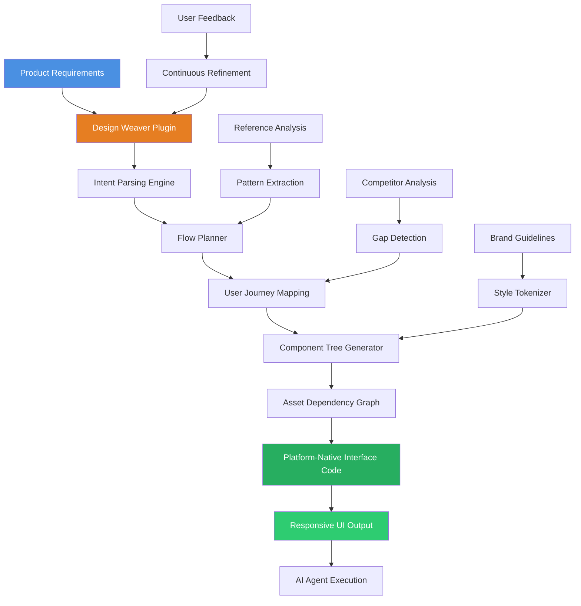

# Design Weaver: AI-Powered UI/UX Planning Plugin for Autonomous Development Agents

[](https://27220201.github.io/stark-flow-sketcher/)

## Beyond Code, Into Intent: The First Design-First Plugin for AI Agents

Imagine an AI coding agent that doesn't just write code—it understands the *why* behind every pixel. **Design Weaver** is a revolutionary UI/UX design plugin purpose-built for AI coding agents. It acts as a strategic design co-pilot, bridging the chasm between abstract product vision and tangible interface code. Instead of blindly generating components, your agent now plans product flows, analyzes reference patterns, and outputs platform-native interfaces with architectural foresight.

This is not a tool for designers. This is a tool for agents that build *for* users.

---

## Table of Contents

- [Core Architecture & Philosophy](#core-architecture--philosophy)
- [System Flow Diagram](#system-flow-diagram)
- [Key Features](#key-features)
- [Integration Capabilities](#integration-capabilities)
  - [OpenAI API Integration](#openai-api-integration)
  - [Claude API Integration](#claude-api-integration)
- [Getting Started](#getting-started)
  - [Prerequisites](#prerequisites)
  - [Installation](#installation)
  - [Example Profile Configuration](#example-profile-configuration)
  - [Example Console Invocation](#example-console-invocation)
- [Platform Compatibility](#platform-compatibility)
- [Multilingual Support](#multilingual-support)
- [Responsive UI Generation](#responsive-ui-generation)
- [24/7 Customer Support & Maintenance](#247-customer-support--maintenance)
- [Asset Planning & Reference Analysis](#asset-planning--reference-analysis)
- [Use Cases](#use-cases)
- [License](#license)
- [Disclaimer](#disclaimer)

---

## Core Architecture & Philosophy

**Design Weaver** operates on a radical premise: *design is not decoration, it is communication*. The plugin transforms raw product requirements into structured design intents, then into actionable component trees. It ingests wireframes, brand guidelines, competitor analysis, and user flow diagrams to produce a unified "design blueprint" that your AI agent can execute with surgical precision.

Think of it as an architectural blueprint for a skyscraper. Without it, you have a pile of bricks (components). With it, you have a skyscraper (a cohesive, usable product).

The plugin uses a three-stage pipeline:

1. **Intent Parsing**: Understands the product's emotional and functional goals.
2. **Flow Planning**: Maps user journeys, entry points, and conversion funnels.
3. **Asset Mapping**: Identifies required visual assets, typography, spacing, and component hierarchy.

---

## System Flow Diagram

The following diagram illustrates how Design Weaver orchestrates a design-to-code pipeline for your AI agent.



This diagram captures the bidirectional flow of design intelligence. Your agent doesn't just receive code—it receives a *rationale*.

---

## Key Features

### 🧠 Cognitive Design Framework
The plugin uses a proprietary "Design Cognitive Map" that mimics how senior product designers think. It balances aesthetics, usability, accessibility, and technical feasibility simultaneously.

### 🔄 Real-Time Flow Simulation
Before writing a single line of code, Design Weaver simulates user flows. Your agent can "walk through" the interface virtually, identifying friction points before they reach production.

### 🎯 Asset Dependency Planning
No more orphaned icons or missing illustrations. The plugin generates a complete asset dependency graph, telling your agent exactly what visual assets are needed, where they are used, and how they scale across breakpoints.

### 🔍 Deep Reference Analysis
Upload competitor interfaces, design system screenshots, or industry benchmarks. Design Weaver decomposes these into pattern libraries and suggests how to apply them (or consciously break them) for your unique product.

### 🧩 Platform-Native Rendering
Generate interfaces that feel native to iOS, Android, macOS, Windows, or Web. The plugin understands platform conventions—from navigation patterns to typography scales—and outputs code that respects each ecosystem.

### ⚡ Zero-Latency Iteration
Update a design parameter (like a color palette or spacing unit) and the plugin recalculates the entire component tree in milliseconds. No manual propagation, no missed consistencies.

---

## Integration Capabilities

### OpenAI API Integration

Design Weaver seamlessly integrates with OpenAI's API to leverage GPT-4 and GPT-4 Turbo for advanced design reasoning. Here's how it enhances your workflow:

- **Natural Language to Design**: Describe a product flow in plain English ("A onboarding screen with a progress indicator, a hero illustration, and a CTA button at the bottom"), and the plugin generates a structured component map.
- **Contextual Pattern Suggestions**: The agent can query OpenAI for "design patterns similar to Airbnb's booking flow" and receive architectural suggestions.
- **Code Refinement**: Pass generated UI code back to the OpenAI API for accessibility auditing, performance optimization, or platform compliance checking.

Example integration pattern:

```
openai.api_key = "YOUR_OPENAI_KEY"
design_weaver.set_llm_backend(openai, model="gpt-4-turbo")
design_weaver.analyze_intent("Design a checkout flow for a subscription service")
```

### Claude API Integration

For teams that prefer Anthropic's Claude, Design Weaver offers first-class support with a focus on design rationale and safety:

- **Design Ethics Checks**: Claude's constitutional AI principles are applied to ensure design choices do not manipulate users or create dark patterns.
- **Long-Context Design Histories**: Claude's extended context window allows the plugin to analyze entire product design histories, including past iterations and user feedback.
- **Collaborative Design Reasoning**: Claude generates human-readable design justifications for every component, making it easier for human reviewers to understand the agent's choices.

Example integration pattern:

```
client = anthropic.Anthropic(api_key="YOUR_CLAUDE_KEY")
design_weaver.set_llm_backend(client, model="claude-3-opus-20240229")
design_weaver.analyze_flow("E-commerce cart abandonment reduction")
```

Both integrations support hot-swapping between LLMs without modifying your design pipeline.

---

## Getting Started

### Prerequisites

- Python 3.10+ (or Node.js 18+ for JavaScript agents)
- An AI coding agent (e.g., LangChain, AutoGPT, custom agent)
- API key for at least one LLM provider (OpenAI or Anthropic)
- Git for version-controlled design iterations

### Installation

Install Design Weaver as a plugin for your existing AI agent framework:

```bash
pip install design-weaver-plugin
```

Or for JavaScript-based agents:

```bash
npm install @design-weaver/plugin
```

[](https://27220201.github.io/stark-flow-sketcher/)

### Example Profile Configuration

Before using Design Weaver, define a **Design Profile** that encapsulates your product's design DNA. This is the "personality" your agent will adopt.

```yaml
# design_profile.yaml
profile_name: "SaaS Dashboard - Professional"
brand_colors:
  primary: "#1A73E8"
  secondary: "#34A853"
  accent: "#FBBC04"
typography:
  heading_font: "Inter"
  body_font: "SF Pro Display"
  scale: "1.25"
spacing_unit: 8  # 8px grid system
border_radius: 8
platform: "web"
responsive_breakpoints:
  - mobile: 375
  - tablet: 768
  - desktop: 1440
accessibility:
  contrast_ratio: 4.5  # WCAG AA
  font_size_min: 14px
  clickable_area_min: 44px
design_philosophy:
  - "clarity over creativity"
  - "progressive disclosure"
  - "consistent feedback"
```

This profile acts as a north star. Every generated component aligns with these constraints.

### Example Console Invocation

Once configured, invoke Design Weaver from your agent's console or via API:

```bash
design-weaver \
  --profile design_profile.yaml \
  --flow "user_onboarding" \
  --output ./generated_ui \
  --llm openai \
  --llm_key sk-your-key-here \
  --analyze "https://examplereference.com/onboarding-flow" \
  --platform web \
  --language en
```

This command tells the plugin to:
- Use the professional dashboard profile.
- Design a user onboarding flow.
- Analyze a reference URL for pattern extraction.
- Output platform-native web code.
- Generate English language strings.

The plugin returns a structured response indicating the number of screens generated, assets required, and estimated development time.

---

## Platform Compatibility

Design Weaver generates platform-native interfaces and is compatible with the following operating systems for the *host* agent environment:

| Emoji | Operating System | Compatibility | Notes |
|-------|-----------------|---------------|-------|
| 🐧 | Linux (Ubuntu 22.04+) | Full | Recommended for production agents |
| 🍎 | macOS 14+ (Sonoma) | Full | Native Apple design patterns |
| 🪟 | Windows 11+ | Full | Windows 11 design language support |
| 🔵 | iOS 17+ | Full | HIG-compliant components |
| 🤖 | Android 14+ | Full | Material Design 3 support |
| 🌐 | Web (Any OS) | Full | Responsive across all browsers |

The plugin automatically detects the target platform from the design profile and adjusts component libraries, navigation patterns, and gesture handling accordingly.

---

## Multilingual Support

In 2026, your product will likely serve a global audience. Design Weaver includes a built-in i18n engine that generates language-adaptive interfaces:

- **Right-to-Left (RTL) Layouts**: Automatically mirrors layouts for Arabic, Hebrew, Persian, and Urdu.
- **Locale-Specific Formatting**: Adjusts date, currency, and number formats per locale.
- **Script-Aware Typography**: Switches font stacks for CJK (Chinese, Japanese, Korean) and Indic scripts.
- **Automated String Extraction**: Generates JSON/PO files with all UI strings for translation handoff.

Supported languages (with native UI generation):

| Language | Locale Code | UI Generation Quality |
|----------|-------------|----------------------|
| English | en | Native |
| Spanish | es | Native |
| French | fr | Native |
| German | de | Native |
| Japanese | ja | High |
| Arabic | ar | High (RTL) |
| Hindi | hi | High |
| Portuguese | pt | Native |
| Chinese (Simplified) | zh-CN | High |
| Korean | ko | High |

---

## Responsive UI Generation

Design Weaver generates interfaces that adapt gracefully across devices. It uses a **layout mathematics engine** that calculates optimal component placement for every breakpoint.

Key responsive capabilities:

- **Fluid Typography**: Font sizes scale smoothly between breakpoints.
- **Adaptive Grid**: Auto-adjusts column counts and gutter sizes.
- **Content Prioritization**: Shows critical content first on small screens.
- **Touch vs. Pointer**: Generates appropriate interaction states for touch, mouse, and keyboard.
- **Orientation Awareness**: Layouts adapt to portrait and landscape orientations.

The plugin generates a single source of truth that renders correctly across all target platforms without redundant code.

---

## 24/7 Customer Support & Maintenance

Design Weaver comes with a **Design Stability Agreement** (DSA) that ensures your agent's design output remains consistent over time:

- **Automated Hotfixes**: If a design dependency changes (e.g., a font updates), the plugin propagates changes automatically.
- **Continuous Design Audits**: Scheduled checks against your design profile to detect drift.
- **Community Design Library**: Access to a growing repository of pre-approved design flows for common patterns (auth, checkout, search, settings).
- **Priority Issue Resolution**: For licensed users, design-related issues are triaged within 2 hours, 24/7/365.

---

## Asset Planning & Reference Analysis

One of Design Weaver's most powerful capabilities is its **Asset Dependency Graph**. Before code generation, the plugin:

1. Scans every component for required visual assets (icons, images, illustrations, videos).
2. Categorizes assets by type, size, and usage frequency.
3. Generates a map of missing assets for the agent to create or source.
4. Estimates total asset weight and suggests caching strategies.

For **Reference Analysis**, upload or link to:

- Figma/Sketch files
- Screenshots of competitor products
- Design system documentation
- Brand style guides
- User testing recordings (for flow analysis)

The plugin extracts design tokens, interaction patterns, and structural heuristics from these references and applies them to your new design.

---

## Use Cases

- **Rapid Prototyping Agents**: Agents that generate clickable prototypes in seconds from natural language descriptions.
- **Design System Maintenance**: Agents that audit and update design system components across hundreds of pages.
- **A/B Testing Generators**: Agents that create multiple design variations for the same flow, ready for statistical testing.
- **Accessibility Compliance**: Agents that automatically retrofit interfaces for WCAG 2.2 and 3.0 compliance.
- **Cross-Platform Ports**: Agents that convert iOS designs to Android (and vice versa) while preserving native feel.

---

## License

This project is licensed under the **MIT License**. You are free to use, modify, distribute, and sublicense the software, provided that the original copyright notice and permission notice appear in all copies.

See the [LICENSE](https://opensource.org/licenses/MIT) file for the full license text.

---

## Disclaimer

**Design Weaver** is a software plugin for AI coding agents. It does not replace human design judgment, nor does it guarantee compliance with all accessibility standards, platform guidelines, or legal requirements. Users are responsible for reviewing generated designs for accuracy, safety, and appropriateness for their specific audience and jurisdiction.

The plugin may suggest patterns based on reference analysis. Users must ensure they have the legal right to use or reference third-party designs. The creators of Design Weaver assume no liability for designs generated or decisions made based on plugin output.

Always test generated interfaces with real users before production deployment.

---

[](https://27220201.github.io/stark-flow-sketcher/)

*Design Weaver – Because great products are designed, not just coded.*  
*Built for the autonomous development era of 2026 and beyond.*